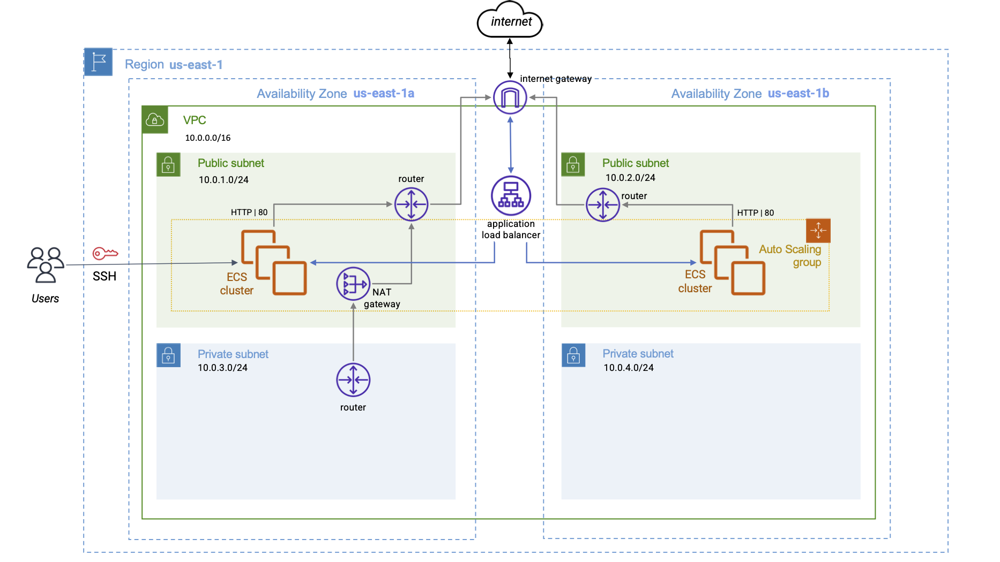

# go-hello-world
Simple HTTP Hello World in Golang

<br/><br/>
# Architecture


<br/><br/>
# Prerequisites
1. Docker installed and running
2. Access to an AWS account
3. aws cli installed
4. terraform 1.1.0 installed
5. python3 installed

<br/><br/>
# Pre-installation
1. Create an IAM user **s4l-terraform** to apply the AWS infrastructure for this project and the S3 bucket and DynamoDB table for the terraform tfstate bucket.
running terraform with a programmatic access user with at least IAM full access permission.
```
  $ terraform -chdir=pre-install apply
```
2. Get the `AWS_ACCESS_KEY_ID` and the `AWS_SECRET_ACCESS_KEY` from the terraform output and write them down to the `~/.aws/credentials` file:
```
[s4l-terraform]
aws_access_key_id = <your_acces_key_id>
aws_secret_access_key = <your_secret_access_key>
```
3. And add the configuration for the `s4l-terraform` user account in the `~/.aws/config` file:
```
[profile s4l-terraform]
region = us-east-1
output = json
```

- Once the AWS user **s4l-terraform**, the terraform state S3 bucket and the DynamoDB lock table have been created, we can apply the resources in the modules under the directory `terraform/modules` for the _development_, _staging_ and _production_ environments.

- The terraform command will apply the changes in AWS using the **s4l-terraform** identity and the S3 bucket and DynamoDb table in the 'us-east-1' region to manage the remote terraform state file as indicated in the `terraform` block of the `main.tf` file in every `env_[dev|staging|prod]` directory:

```hcl
terraform {
  backend "s3" {
    profile        = "s4l-terraform"
    encrypt        = "true"
    bucket         = "s4l-terraform-state"
    key            = "dev/hello-world/terraform.tfstate"
    dynamodb_table = "s4l-lock-dynamo"
    region         = "us-east-1"
  }
}
```

<br/><br/>
# Installation
- Run the following commands to install the AWS ECS cluster in the development environment:
```
  $ terraform -chdir=terraform/env_dev init
  $ terraform -chdir=terraform/env_dev plan
  $ terraform -chdir=terraform/env_dev apply
```

- As a result of the last command, the DNS name assigned to the load balancer that distributes the traffic to the EC2 instances of the ECS cluster is shown in the output `alb_dns_name`. Use this DNS to hit the **go-hello-world** service.

```
...
Apply complete! Resources: 40 added, 0 changed, 0 destroyed.

Outputs:

alb_dns_name = "go-hello-world-alb-dev-1896166617.us-east-1.elb.amazonaws.com"
repository_name = "912061915192.dkr.ecr.us-east-1.amazonaws.com/go-hello-world"
vpc_id = "vpc-06f5a84ddac1a105f"
```  
- In `ECS > Clusters`, if you click on the **go-hello-world-cluster-dev** cluster, you'll see a **go-hello-world-service** with no tasks running. This happens because the task is defined to pull the 'go-hello-world' image from the corresponding ECR repository, but no image has been pushed to the repository yet.  

<br/><br/>
# Automatic deployment: CI/CD

- The file `.github/workflows/workflow.yml` contains the definition of the CI/CD workflow.

- Whenever you push a new commit to the `master` branch the CI (continuous integration) workflow job is triggered: 
  - the code is built, 
  - the tests are run,
  - the code is analyzed.  

- Whenever you want to release a new version, tag the commit with the version number and push it to the remote origin branch. For example, if you want to deploy the release version `v0.3`, run the following commands on the `master` branch:
```shell
  $ git checkout master
  $ git tag v0.3
  $ git push origin v0.3
```
- The CD job is triggered after the CI job has successfully finished. It executes the following steps:
  - Login to the ECR repository
  - Build the docker image of the golang application,
  - Push the image with the tagged version `v0.3` to the ECR repository,
  - Update the task definition of the ECS service with the tagged image of this version (v0.3)

- If the complete CI/CD job finishes with no errors, the application has been successfully rolling updated in the development ECS cluster.  

<br/><br/>
# On-demand deployment and other actions

Set the variables in the Makefile according to your personal values.

### *Deploy the application to ECS service*
```
  $ make deploy
```

### *Login the ECR repository*
``` 
  $ make login
```

### *Build the docker image*
``` 
  $ make build
```
- A docker image will be created in the local repository (the binary will be compiled for `linux amd64` platform only).

### *Run the application in a docker container*
``` 
  $ make run
```
- The webserver will be available at the specified port (`80`).

- Endpoints
  - `/` -> Hello World
  - `/health` -> health check

### *Stop the docker container*
``` 
  $ make stop
```

### *Push the image to the ECR repository*
```
  $ make push
```

<br/><br/>
# Connect to an EC2 instance of the cluster
- Terraform generates a SSH key pair. 
- The public key is save in the `authorized_keys` of the EC2 instance.
- The private key is saved in a local file in the path `.ssh/ec2key-dev.pem`.
- Connect to the EC2 using the following command:
```
  $ ssh -i ".ssh/ec2key-dev.pem" ec2-user@<public_ipv4_dns>
```
